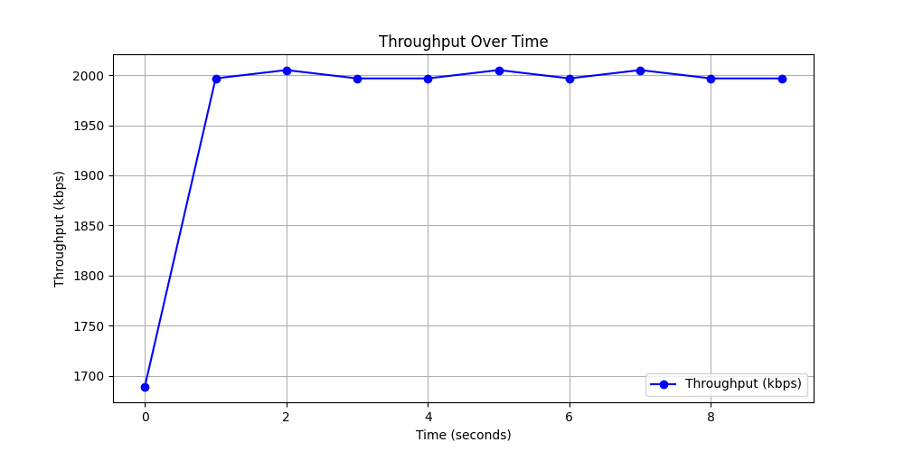
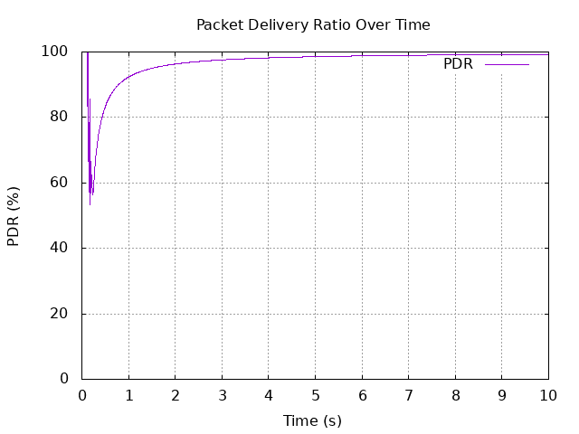

# NS2 Project Simulation

## Overview
This project is a network simulation implemented using **NS2 (Network Simulator 2)**. It evaluates network performance metrics such as **Throughput**, **Packet Delivery Ratio (PDR)**, and **Latency** by simulating different network topologies and traffic patterns.

## Project Structure
```
NS2 Project Simulation
│── graphs/                # Contains plotted graphs of simulation results
│   ├── pdr_plot.plt       # Gnuplot script for PDR visualization
│   ├── pdr_plot.png       # Output graph for PDR
│   ├── pdr.dat            # Data file for PDR computation
│
│── scripts/               # Contains TCL and AWK scripts
│   ├── main.tcl           # Main NS2 simulation script
│   ├── pdr.awk            # AWK script to compute PDR from trace files
│   ├── test.tcl           # Additional TCL test script
│   ├── throughput.awk     # AWK script to compute throughput
│
│── traces/                # Stores trace and NAM files generated from simulations
│   ├── simulation.nam     # NAM file for animation visualization
│   ├── simulation.tr      # Trace file containing network event logs
│
│── results/               # Stores computed results
│   ├── throughput.txt     # Throughput values computed from AWK script
│
│── readme.md              # Project documentation (this file)
```

## Prerequisites
- **NS2 (Network Simulator 2)** installed.
- **AWK** for processing trace files.
- **Gnuplot** for graph visualization.
- **Docker** (if running the simulation inside a container).

## Setting Up the Environment
### **Option 1: Using Docker**
1. **Run the NS2 Docker container:**
   ```bash
   docker run -it --name ns2_container -v "$PWD:/ns2project" ubuntu:18.04 /bin/bash
   ```
2. **Install NS2 inside the container:**
   ```bash
   apt update && apt install -y ns2 gawk gnuplot
   ```

### **Option 2: Running NS2 Locally**
1. Install NS2:
   ```bash
   sudo apt install ns2
   ```
2. Install AWK and Gnuplot:
   ```bash
   sudo apt install gawk gnuplot
   ```

## Running the Simulation
### **Step 1: Execute the TCL Script**
```bash
ns scripts/main.tcl
```
This generates trace files inside the `traces/` directory.

### **Step 2: Compute Throughput**
```bash
awk -f scripts/throughput.awk traces/simulation.tr > results/throughput.txt
```

### **Step 3: Compute Packet Delivery Ratio (PDR)**
```bash
awk -f scripts/pdr.awk traces/simulation.tr > results/pdr.dat
```

### **Step 4: Visualize Results**
#### **Throughput Graph (Gnuplot)**
1. **Create a throughput data file:**
   ```bash
   echo "0 200
   10 400
   20 500" > results/throughput.dat
   ```
2. **Plot with Gnuplot:**
   ```bash
   gnuplot -p -e "plot 'results/throughput.dat' using 1:2 with lines title 'Throughput'"
   ```

#### **PDR Graph (Gnuplot)**
```bash
gnuplot -p graphs/pdr_plot.plt
```

## Modifications and Extensions
- **Implement UDP traffic** for performance comparison.
- **Test different mobility models** such as **Random Waypoint**.
- **Experiment with varying node densities** to analyze network behavior.

## Troubleshooting
### **"No such file or directory" error while running AWK scripts**
Ensure that the `results/` directory exists before executing AWK commands:
```bash
mkdir -p results
```

### **Docker container error: "Conflict. The container name is already in use"**
Remove or restart the container:
```bash
docker rm -f ns2_container
```

## 📈 Throughput Graph

This graph shows the variation of throughput over time as calculated from the NS2 simulation results.



## 📊 Packet Delivery Ratio (PDR) Graph

This graph represents the Packet Delivery Ratio (PDR) over the simulation time.



## Contributors
- Deep Habiswashi
- Avilasha Goswami
- Ajit Tripathy
- Anmol Subham